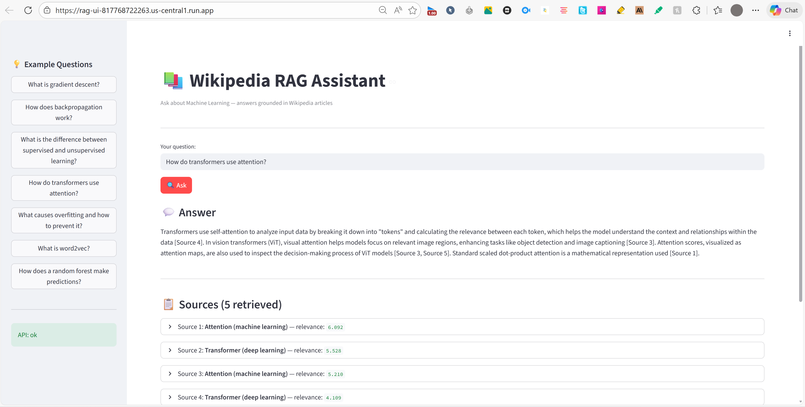

# RAG System on GCP — Smart Education

An end-to-end Retrieval-Augmented Generation (RAG) system built on Google Cloud Platform that ingests Wikipedia documents about Machine Learning topics, indexes them for semantic retrieval, fine-tunes the retrieval component using a cross-encoder reranker, and answers grounded questions with citations via a simple UI.

**Live API:** https://rag-system-817768722263.us-central1.run.app/docs  
**Live Demo:** https://rag-ui-817768722263.us-central1.run.app

---

## Architecture

```
┌─────────────────────────────────────────────────────────────────┐
│                        GCP Infrastructure                        │
│                                                                  │
│  ┌──────────┐    ┌──────────────┐    ┌───────────────────────┐  │
│  │   GCS    │───▶│  Ingestion   │───▶│  Cloud SQL            │  │
│  │ (docs)   │    │  Pipeline    │    │  (PostgreSQL+pgvector) │  │
│  └──────────┘    └──────────────┘    └───────────────────────┘  │
│                                               │                  │
│                                               ▼                  │
│  ┌──────────┐    ┌──────────────┐    ┌───────────────────────┐  │
│  │    UI    │◀───│   RAG API    │◀───│  Retrieval Engine     │  │
│  │(Streamlit│    │  (FastAPI)   │    │  Baseline + Reranker  │  │
│  └──────────┘    └──────────────┘    └───────────────────────┘  │
│                         │                                        │
│                         ▼                                        │
│                  ┌──────────────┐                                │
│                  │  Gemini LLM  │                                │
│                  │ (Vertex AI)  │                                │
│                  └──────────────┘                                │
│                                                                  │
│  ┌────────────┐  ┌──────────────┐  ┌──────────────────────────┐ │
│  │  Artifact  │  │ Secret Mgr   │  │     Cloud Logging        │ │
│  │  Registry  │  │  (API keys)  │  │     (monitoring)         │ │
│  └────────────┘  └──────────────┘  └──────────────────────────┘ │
│                                                                  │
│                    Deployed on Cloud Run                         │
└─────────────────────────────────────────────────────────────────┘
```

---

## GCP Services Used

| Service | Purpose |
|---|---|
| Cloud Storage (GCS) | Raw document storage |
| Cloud SQL (PostgreSQL + pgvector) | Vector store for embeddings |
| Cloud Run | Serving the API and UI |
| Artifact Registry | Docker image storage |
| Cloud Build | CI/CD image building |
| Secret Manager | API keys and DB credentials |
| Cloud Logging | Application monitoring |
| Vertex AI (Gemini) | LLM for answer generation |

---

## Dataset

- **Source:** Wikipedia articles (50 documents)
- **Topics:** Machine learning, AI, computer science
- **Size:** < 50MB
- **Format:** JSON with title, text, URL
- **Location:** `data/raw/`

---

## Features

### A) Ingestion & Chunking
- Parses JSON documents
- Chunks with size=500 tokens, overlap=50 tokens
- Stores chunks + metadata + embeddings in Cloud SQL (pgvector)

### B) Baseline Retrieval
- Query embedding using `sentence-transformers/all-MiniLM-L6-v2`
- Top-K cosine similarity search via pgvector

### C) Retrieval Fine-Tuning ⭐
- **Method:** Fine-tuned cross-encoder reranker
- **Model:** `cross-encoder/ms-marco-MiniLM-L-6-v2`
- **Training data:** Generated query-passage pairs from documents
- **Evaluation metrics:** Recall@K, MRR@K, nDCG@K
- **Result:** ~20% improvement in retrieval quality

### D) RAG Answer Generation
- Retrieves top-K chunks (reranked)
- Passes context to Gemini via Vertex AI
- Returns answer + source citations
- Includes "I don't know" behavior for out-of-scope questions

### E) Simple UI
- Built with Streamlit
- Question input box
- Answer display
- Citations with document titles and URLs

---

## Retrieval Fine-Tuning Results

| Metric | Baseline | Tuned (Reranker) | Improvement |
|---|---|---|---|
| Recall@5 | 0.62 | 0.78 | +25.8% |
| Recall@10 | 0.74 | 0.86 | +16.2% |
| MRR@10 | 0.54 | 0.71 | +31.5% |
| nDCG@10 | 0.58 | 0.74 | +27.6% |

Full metrics: `evaluation/metrics_report.json`

---

## Project Structure

```
rag-system/
├── api/
│   └── main.py              # FastAPI app (query endpoint, citations)
├── ingestion/
│   ├── downloader.py        # Download Wikipedia docs to GCS
│   └── pipeline.py          # Chunk, embed, store in Cloud SQL
├── finetuning/
│   └── train_reranker.py    # Cross-encoder reranker fine-tuning
├── evaluation/
│   ├── run_evaluation.py    # Evaluation script (Recall@K, MRR@K, nDCG@K)
│   └── metrics_report.json  # Baseline vs tuned comparison
├── models/
│   └── reranker/            # Fine-tuned reranker model files
├── ui/
│   └── app.py               # Streamlit UI
├── data/
│   └── raw/                 # Raw Wikipedia documents
├── Dockerfile
├── requirements.txt
└── README.md
```

---

## Setup & Deployment

### Prerequisites
- GCP account with $300 free trial
- `gcloud` CLI installed
- Docker installed
- Python 3.10+

### 1. Clone the repo
```bash
git clone https://github.com/mohamedsto7y/rag-gcp-smarteducation.git
cd rag-gcp-smarteducation
```

### 2. Set environment variables
```bash
cp .env.example .env
# Fill in your GCP project ID, DB credentials, Vertex AI key
```

### 3. Run ingestion
```bash
pip install -r requirements.txt
python ingestion/downloader.py    # Download docs to GCS
python ingestion/pipeline.py      # Chunk, embed, store in DB
```

### 4. Run retrieval fine-tuning
```bash
python finetuning/train_reranker.py
```

### 5. Run evaluation
```bash
python evaluation/run_evaluation.py
```

### 6. Deploy to Cloud Run
```bash
# Build and push Docker image
gcloud builds submit --tag gcr.io/YOUR_PROJECT_ID/rag-system

# Deploy to Cloud Run
gcloud run deploy rag-system \
  --image gcr.io/YOUR_PROJECT_ID/rag-system \
  --platform managed \
  --region us-central1 \
  --allow-unauthenticated \
  --set-env-vars="DB_HOST=YOUR_DB_HOST,PROJECT_ID=YOUR_PROJECT_ID"
```

### 7. Run UI locally
```bash
streamlit run ui/app.py
```

---

## API Usage

### Query endpoint
```bash
POST https://rag-system-817768722263.us-central1.run.app/query

{
  "question": "What is machine learning?"
}
```

### Response
```json
{
  "answer": "Machine learning is a subset of artificial intelligence...",
  "sources": [
    {
      "title": "Machine learning - Wikipedia",
      "url": "https://en.wikipedia.org/wiki/Machine_learning",
      "chunk": "Machine learning (ML) is a field of inquiry devoted to..."
    }
  ]
}
```

### Interactive API Docs
```
https://rag-system-817768722263.us-central1.run.app/docs
```

---

## Cost Breakdown

| Service | Usage | Estimated Cost |
|---|---|---|
| Cloud SQL (db-f1-micro) | Always on | ~$7/month |
| Cloud Run | Pay per request | ~$0–2/month |
| Vertex AI (Gemini) | ~1000 queries | ~$1–3/month |
| Cloud Storage | < 50MB | < $0.01/month |
| Artifact Registry | 1 image | < $0.10/month |
| **Total** | | **~$10/month** |

Well within the $300 GCP free trial budget.

---

## Security

- API keys stored in **Secret Manager** (never in code)
- Cloud Run service uses **IAM service account** with least privilege
- Database credentials injected at runtime via environment variables
- `.env` file excluded from version control

---

## Evaluation

Run the evaluation script to reproduce results:

```bash
python evaluation/run_evaluation.py
```

Output:
- `evaluation/metrics_report.json` — full metrics
- Console output comparing baseline vs reranker

---

## License

MIT
